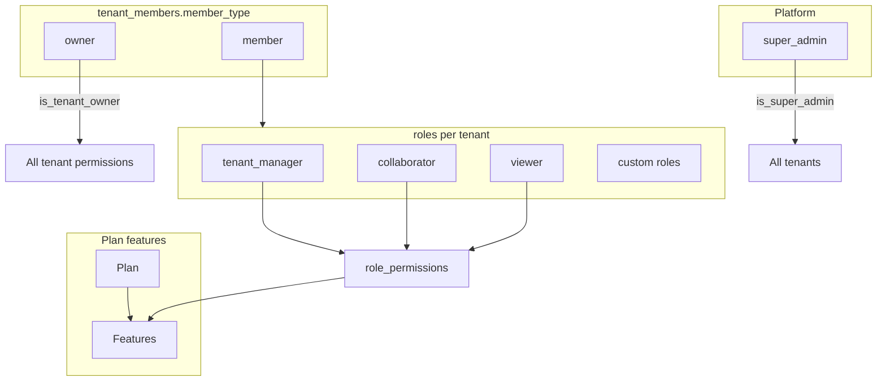

# Roles, Memberships, Permissions & Entitlement

Authoritative reference for access control in SaaS Foundation.  
Security is enforced in **Postgres (RLS + RPC)**; the frontend only reflects permissions cosmetically.

---

## 1) Two axes (not a linear chain)

### Product / entitlement

`Tenant → Subscription → Plan → Features` (+ Billing hangs off Subscription — see `docs/BILLING.md`)

### Authorization

`User → Membership (tenant_members) → Roles (1+) → Permissions`

### Effective access

```
puede hacer X =
  (tiene permiso X vía algún rol asignado)
  ∩ (el tenant tiene la feature que habilita X)
```

**Hard-gates (exceptions):**

| Gate | Rule |
|------|------|
| `is_super_admin()` | Always `true` for any permission code |
| `is_tenant_owner(tenant_id)` | `true` for **non-`platform.*`** permissions (no feature check) |
| `platform.*` | Only via `is_super_admin()` — never via tenant roles or owner |

`has_permission(tenant_id, code)` implements the above. Eligible subscription statuses for feature gating: `active`, `trialing`.

---

## 2) Three membership layers

These are **not** interchangeable.

| Layer | Values | Storage | Purpose |
|-------|--------|---------|---------|
| **Platform** | `super_admin` | `super_admins` | Cross-tenant / catalog CRUD |
| **Tenant membership** | `owner`, `member` | `tenant_members.member_type` | Structural relationship |
| **Tenant RBAC** | `tenant_manager`, `collaborator`, `viewer`, custom… | `roles` + `role_permissions` + `tenant_member_roles` | Operational permissions |



### 2.1 `super_admin`

- Row in `public.super_admins`.
- Only actors who can CRUD global **features**, **plans**, **permissions** (and joins).
- Reference codes: `platform.features_read`, `platform.features_write`, `platform.plans_*`, `platform.permissions_*`, `platform.tenants_*` — **not** granted via tenant roles.

### 2.2 `owner` (`member_type`)

- Implicit full tenant-scoped access via `is_tenant_owner`.
- Can change plan (`change_tenant_plan`), assign roles, manage members.
- Does **not** require `tenant_member_roles`.

### 2.3 `member` (`member_type`)

- Default for invited users.
- Permissions only from assigned roles ∩ plan features.
- Invitation accept assigns system role **`collaborator`**.

---

## 3) Features & permission codes

Permissions are named `{feature}.{action}` and each row has `permissions.feature_id` → `features.id`. Feature gating uses that FK ∩ `plan_features` (not only the legacy `feature_permissions` join).

| Feature code | Enables permission codes |
|--------------|--------------------------|
| `profile` | `profile.read`, `profile.update` |
| `members` | `members.read`, `members.invite`, `members.update`, `members.delete` |
| `roles` | `roles.read`, `roles.assign`, `roles.create`, `roles.update`, `roles.delete`, `roles.permissions_read` |
| `settings` | `settings.read`, `settings.update` |
| `subscription` | `subscription.read` |
| `platform` | `platform.features_read`, `platform.features_write`, `platform.plans_*`, `platform.permissions_*`, `platform.tenants_*` |

Tables: `features`, `plan_features`, `permissions` (`feature_id`), `feature_permissions` (kept in sync from `feature_id`).  
Phase 1: plans `free`, `premium`, `enterprise` all include the product features above (differentiation later).

Catalog seed: `supabase/migrations/20250315000000_seed_members_permissions.sql` + entitlement / rename migrations.

---

## 4) Default roles (seed per tenant)

Created by `seed_default_tenant_roles` / migrated by `migrate_tenant_system_roles`.

| Role code | Name | Default on invite | Purpose |
|-----------|------|-------------------|---------|
| `tenant_manager` | Tenant manager | No | Day-to-day admin without ownership |
| `collaborator` | Collaborator | **Yes** | Standard collaborator |
| `viewer` | Viewer | No | Read-only |

Legacy mapping: `admin` → `tenant_manager`, `member` → `collaborator`, `guest` → `viewer`.

### 4.1 Permission matrix (members; owner = all tenant-scoped)

| Permission | owner | tenant_manager | collaborator | viewer |
|------------|:-----:|:--------------:|:------------:|:------:|
| `profile.read` | ✓ | ✓ | ✓ | ✓ |
| `profile.update` | ✓ | ✓ | ✓ | ✓ |
| `members.read` | ✓ | ✓ | ✓ | — |
| `members.invite` | ✓ | ✓ | — | — |
| `members.update` | ✓ | ✓ | — | — |
| `members.delete` | ✓ | ✓ | — | — |
| `roles.read` | ✓ | ✓ | — | — |
| `roles.assign` | ✓ | ✓ | — | — |
| `roles.permissions_read` | ✓ | ✓ | — | — |
| `roles.create/update/delete` | —† | — | — | — |
| `settings.read` | ✓ | ✓ | ✓ | ✓ |
| `settings.update` | ✓ | ✓ | — | — |
| `subscription.read` | ✓ | ✓ | ✓ | — |

†Role/permission **definition** CRUD is **super_admin only** (RLS). Owners and `tenant_manager` can **assign** existing roles (`roles.assign`), not edit the catalog.

---

## 5) Key RPCs

| RPC | Who |
|-----|-----|
| `has_permission(tenant_id, code)` | Effective access (role ∩ feature via `permissions.feature_id` + gates) |
| `change_tenant_plan(tenant_id, plan_id)` | Owner or super_admin |
| `set_tenant_member_roles(tenant_id, user_id, role_ids[])` | Owner, super_admin, or `roles.assign` |
| Roles / role_permissions **CRUD** (UI + RLS) | **super_admin only** (owners read + assign; cannot edit role definitions) |
| Permissions catalog **CRUD** | **super_admin only** |

---

## 6) App feature map

| Feature folder | Permission gate |
|----------------|-----------------|
| `features/members` | `members.read` (any member with permission; not owner-only) |
| `features/roles` | `roles.read` (tabs Roles&Permissions / Permissions: super_admin) |
| `features/settings` | `settings.read` (plan change UI: owner only) |
| `features/features-plans` | super_admin |
| `features/profile` | auth (+ `profile.*` when gated) |

When adding a product capability:

1. Add `permissions` rows with `feature_id` set to the owning `features` row (and keep `feature_permissions` in sync if still used).
2. Attach feature to plans in `plan_features`.
3. Assign to default roles in `seed_default_tenant_roles` if needed.
4. Guard route / nav with `data.permission`.
5. Update this matrix.

---

## 7) Verify / tests

```bash
npm run verify:authz-gates   # has_permission matrix + change_tenant_plan + catalog write deny
npm run verify:all           # full smoke (db-sync, setup, authz, invitations, …)
npm test                     # Angular unit (PermissionService, members.permissions, …)
```

Optional: set `SUPABASE_SERVICE_ROLE_KEY` in `.env.test.local` so `verify:authz-gates` also asserts **role permission ∩ missing plan feature → deny** (temporarily unlinks `members` from the tenant plan).

---

## 8) Related issues

Epic: **#34** Planes + Features + RBAC. Phase 2 billing: #49–#51 (`docs/BILLING.md`).
