# Roles, Memberships & Permissions

Authoritative reference for access control in SaaS Foundation.  
Security is enforced in **Postgres (RLS + RPC)**; the frontend only reflects permissions cosmetically.

---

## 1) Three membership layers

These are **not** interchangeable. A user can be in more than one layer at once.

| Layer | Values | Storage | Purpose |
|-------|--------|---------|---------|
| **Platform** | `super_admin` | Table `super_admins` | Cross-tenant operations (support, platform admin) |
| **Tenant membership** | `owner`, `member` | `tenant_members.member_type` (text) | Structural relationship to a tenant |
| **Tenant RBAC** | `admin`, `member`, `guest`, custom… | Tables `roles`, `role_permissions`, `tenant_member_roles` | Operational permissions inside a tenant |

```mermaid
flowchart TB
  subgraph platform [Platform]
    SA[super_admin]
  end

  subgraph membership [tenant_members.member_type]
    OW[owner]
    MB[member]
  end

  subgraph rbac [roles per tenant]
    AD[admin]
    ME[member]
    GU[guest]
    CU[custom roles]
  end

  SA -->|is_super_admin RPC| AllTenants[All tenants]
  OW -->|is_tenant_owner RPC| AllPerms[All tenant permissions]
  MB --> rbac
  AD --> Perms[role_permissions]
  ME --> Perms
  GU --> Perms
```



### 1.1 `super_admin` (platform)

- Row in `public.super_admins` linked to `auth.users`.
- Checked via `public.is_super_admin()`.
- `has_permission` returns **true** for any permission code.
- Can access any tenant (via `get_access_context` + RLS).
- **Not** a `member_type`.

### 1.2 `owner` (tenant membership)

- `tenant_members.member_type = 'owner'`.
- Typically **one per tenant** (the creator). Ownership transfer is a future flow.
- `has_permission` returns **true** for any tenant-scoped permission via `is_tenant_owner(tenant_id)`.
- Does **not** require a row in `tenant_member_roles` (implicit full access).

### 1.3 `member` (tenant membership)

- `tenant_members.member_type = 'member'`.
- Default for invited users.
- Permissions come **only** from assigned roles (`tenant_member_roles` → `role_permissions`).
- Without a role → no tenant permissions (except `profile.self.*`).

### 1.4 Why not `guest` as a 4th membership?

**Decision:** do **not** add `guest` to `member_type`.

Use a **role** `guest` with read-only permissions instead.  
Membership stays `member`; the role defines limited access (similar to Jira “Viewer”).

External collaborators without tenant membership are **out of scope** for v1.

---

## 2) Features and permission codes

Permissions are named **`{scope}.{feature}.{action}`**.  
Features map to app routes and UI modules.

| Feature | Route | Permission codes |
|---------|-------|------------------|
| **home** | `/` | *(none — any member with tenant context)* |
| **profile** | `/profile` | `profile.self.read`, `profile.self.update` |
| **members** | `/members` | `tenant.members.read`, `.invite`, `.update`, `.delete` |
| **roles** | `/roles` | `tenant.roles.read`, `.create`, `.update`, `.delete`, `.assign` |
| **settings** | `/settings` | `tenant.settings.read`, `.update` |
| **subscription** | part of home/settings | `subscription.read` |
| **platform** | internal | `platform.*` (super_admin only) |

Catalog is seeded in `supabase/migrations/20250315000000_seed_members_permissions.sql`.

### 2.1 How checks work

```
has_permission(tenant_id, code) :=
  is_super_admin()
  OR is_tenant_owner(tenant_id)
  OR EXISTS (role_permissions JOIN tenant_member_roles for auth.uid())
```

Frontend: `PermissionService` → RPC `has_permission`.  
Routes: `permissionGuard` with `data.permission`.

---

## 3) Default roles (seed per tenant)

Created automatically when a tenant is created (`create_tenant_with_owner` — see migration `seed_default_tenant_roles`).

| Role code | Name | Who gets it | Purpose |
|-----------|------|-------------|---------|
| `admin` | Administrator | Assigned manually or to trusted members | Day-to-day admin without ownership |
| `member` | Member | **Default** on invitation accept | Standard collaborator |
| `guest` | Guest | Assigned manually | Read-only viewer |

### 3.1 Permission matrix (default seed)

| Permission | owner | admin | member | guest |
|------------|:-----:|:-----:|:------:|:-----:|
| `profile.self.read` | ✓ | ✓ | ✓ | ✓ |
| `profile.self.update` | ✓ | ✓ | ✓ | ✓ |
| `tenant.members.read` | ✓ | ✓ | ✓ | — |
| `tenant.members.invite` | ✓ | ✓ | — | — |
| `tenant.members.update` | ✓ | ✓ | — | — |
| `tenant.members.delete` | ✓ | ✓ | — | — |
| `tenant.roles.read` | ✓ | ✓ | — | — |
| `tenant.roles.assign` | ✓ | ✓ | — | — |
| `tenant.roles.create` | ✓ | — | — | — |
| `tenant.roles.update` | ✓ | — | — | — |
| `tenant.roles.delete` | ✓ | — | — | — |
| `tenant.settings.read` | ✓ | ✓ | ✓ | ✓ |
| `tenant.settings.update` | ✓ | ✓ | — | — |
| `subscription.read` | ✓ | ✓ | ✓ | — |

**Notes:**

- **owner** rows use implicit permissions; seed roles are for **members**.
- **admin** cannot create/delete roles by default (only owner). Adjust if product wants admins to manage role definitions (ticket V15).
- On **invitation accept**: `member_type = 'member'` + assign role `member` (never `owner` — see V17).

---

## 4) Who can do what (operations)

| Operation | owner | admin role | member role | guest role |
|-----------|-------|------------|-------------|------------|
| Create tenant | ✓ (onboarding) | — | — | — |
| Invite users | ✓ | ✓ | — | — |
| Accept invitation | invitee | invitee | invitee | invitee |
| Assign roles | ✓ | ✓ | — | — |
| Create custom roles | ✓ | —* | — | — |
| Edit tenant settings | ✓ | ✓ | — | — |
| View members | ✓ | ✓ | ✓ | — |
| Switch tenant (UI) | multi-tenant | multi-tenant | multi-tenant | multi-tenant |
| Switch tenant (super_admin) | ✓ | — | — | — |

\*Unless `tenant.roles.create` is granted to admin in a future policy change.

---

## 5) Comparison with Jira

| Jira | SaaS Foundation |
|------|-----------------|
| Site admin | `super_admin` |
| Organization owner | `owner` (member_type) |
| Organization member | `member` (member_type) |
| Project role (Admin, Member, Viewer) | Tenant role (`admin`, `member`, `guest`) |
| Permission scheme | `role_permissions` + `permissions` catalog |
| Invite by email | `create_invitation` + email (V07) |

---

## 6) App feature map

| Feature folder | Store/Service | Permission gate |
|----------------|---------------|-----------------|
| `features/home` | `home.store` | onboarding only |
| `features/profile` | *(V13)* | auth only |
| `features/members` | `members.store` | `tenant.members.read` |
| `features/roles` | `roles.store` | `tenant.roles.read` |
| `features/settings` | `settings.store` | `tenant.settings.read` |
| `features/accept-invitation` | `accept-invitation.store` | public + auth |
| `features/onboarding-create-tenant` | tenant onboarding | auth only |

When adding a feature:

1. Add permission codes to seed migration (if new domain).
2. Add route `data.permission` if tenant-scoped.
3. Add nav item with `permission` in `navigation.service.ts`.
4. Update matrix in this document.
5. Assign new permissions to default roles in `seed_default_tenant_roles` (or migration patch).

### 2.2 Example: future `customer` feature

Use the existing naming convention `{scope}.{feature}.{action}` (not `customer_create`):

| Permission code | admin | member | guest |
|-----------------|:-----:|:------:|:-----:|
| `tenant.customers.read` | ✓ | ✓ | ✓ |
| `tenant.customers.create` | ✓ | ✓ | — |
| `tenant.customers.update` | ✓ | ✓ | — |
| `tenant.customers.delete` | ✓ | — | — |

Flow:

1. Insert rows in `permissions` (global catalog).
2. Link roles in `role_permissions` (per tenant, via seed or V15 UI).
3. Guard route: `data: { permission: 'tenant.customers.read' }`.
4. RPC/RLS checks `has_permission(tenant_id, 'tenant.customers.delete')` for destructive ops.

**owner** always has all permissions implicitly; the matrix above is for **member** users with an assigned role.

---

## 7) Related tickets

- **V11** — DB seed default roles on tenant create
- **V15** — UI CRUD custom roles
- **V17** — Invitations always `member_type: member`
